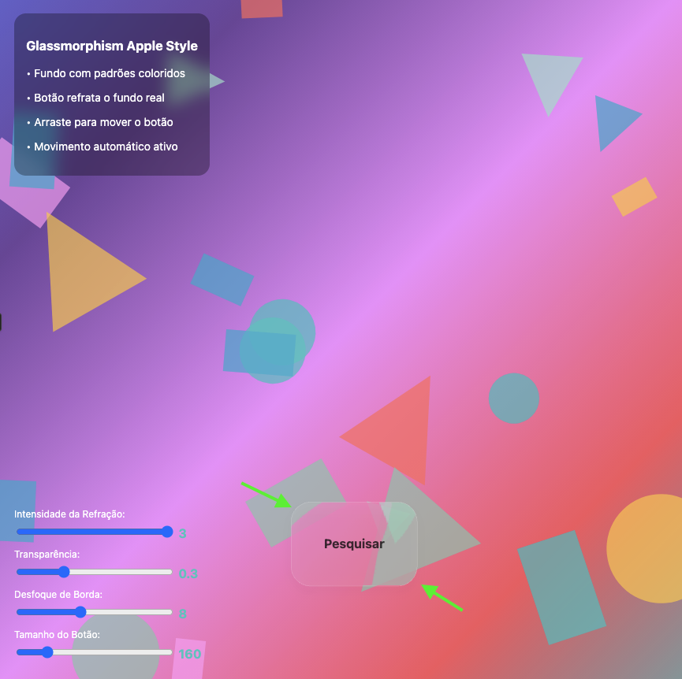

# Glassmorphism Apple Style - Efeito de Refração Real

Um projeto que demonstra o efeito glassmorphism moderno com refração real usando Canvas API e técnicas avançadas de renderização. O projeto simula o efeito de vidro translúcido encontrado no design system da Apple, com refração óptica autêntica.


## 🎯 Funcionalidades

O projeto apresenta um botão interativo com efeito de vidro que:
- ✨ Refrata o fundo em tempo real
- 🎮 Segue o movimento do mouse
- 🎛️ Permite controle dinâmico dos parâmetros
- 📱 É totalmente responsivo

## 🛠️ Tecnologias Utilizadas

- **HTML5 Canvas API** - Para renderização gráfica de alta performance
- **JavaScript ES6+** - Arquitetura orientada a objetos moderna
- **CSS3** - Estilos modernos e responsivos
- **Three.js** - Biblioteca 3D para futuros aprimoramentos (preparada mas não utilizada atualmente)

## 🎨 Recursos Principais

### Efeito de Refração Real
O projeto implementa refração óptica autêntica através de:
- Análise pixel-por-pixel do fundo
- Distorção baseada em física ótica
- Simulação de lente convexa
- Renderização em tempo real

### Fundo Animado Dinâmico
- Gradientes animados com movimento senoidal
- 25+ objetos geométricos em movimento
- Texto de fundo sutil
- Grid discreto para profundidade

### Controles Interativos
- **Intensidade da Refração**: 0.5x - 3.0x
- **Transparência**: 10% - 80%
- **Desfoque de Borda**: 0px - 20px
- **Tamanho do Botão**: 120px - 350px

## 📁 Estrutura do Projeto

```
glassmorphism/
├── index.html          # Estrutura HTML principal
├── styles.css          # Estilos CSS separados
├── script.js           # Lógica JavaScript modularizada
└── README.md           # Documentação do projeto
```

## 🏗️ Arquitetura

### Classe Principal: `GlassmorphismEffect`

A aplicação é estruturada usando padrões modernos de JavaScript:

```javascript
class GlassmorphismEffect {
    constructor()           // Inicialização
    init()                 // Setup principal
    setupCanvases()        // Configuração dos canvas
    createBackgroundPattern() // Criação do fundo animado
    drawGlassButton()      // Renderização do botão com efeito
    animate()              // Loop de animação
}
```

### Principais Métodos

#### `createRefractionEffect(width, height)`
Implementa o algoritmo de refração:
```javascript
// Análise pixel por pixel
for(let y = 0; y < height; y++) {
    for(let x = 0; x < width; x++) {
        // Calcular distorção baseada na distância do centro
        const distortion = Math.sin(normalizedDistance * Math.PI * 0.5) * 
                          this.refractionStrength * 0.1;
        // Aplicar refração
        const sourceX = Math.round(x - dx * distortion);
        const sourceY = Math.round(y - dy * distortion);
    }
}
```

#### `updateBackgroundObjects()`
Gerencia animação de 25+ objetos com:
- Movimento independente
- Rotação contínua
- Wrap-around nas bordas
- Três tipos de formas (círculo, retângulo, triângulo)

## 🚀 Como Executar

1. **Clone o repositório:**
```bash
git clone [url-do-repositorio]
cd glassmorphism
```

2. **Abra o projeto:**
```bash
# Abrir diretamente no navegador
open index.html

# Ou servir localmente (recomendado)
python -m http.server 8000
# Então acesse: http://localhost:8000
```

3. **Interaja com o efeito:**
- Mova o mouse para ver o botão seguir
- Ajuste os controles na parte inferior esquerda
- Clique e arraste para posicionamento manual

## 🎯 Conceitos Técnicos Implementados

### Refração Óptica
O efeito simula uma lente convexa real:
- **Lei de Snell simplificada**: Mudança de direção da luz
- **Distorção radial**: Maior nas bordas, menor no centro
- **Interpolação bilinear**: Suavização de pixels

### Performance Otimizada
- **requestAnimationFrame**: Sincronização com refresh rate
- **Canvas duplo**: Separação de fundo e efeito
- **Clipping masks**: Renderização apenas na área necessária
- **ImageData manipulation**: Acesso direto aos pixels

### Responsividade
- **Redimensionamento dinâmico**: Recalcula canvas automaticamente
- **Coordenadas relativas**: Funciona em qualquer resolução
- **Touch support**: Preparado para dispositivos móveis

## 🔧 Personalização

### Modificar Cores do Gradiente
Em `script.js`, método `drawAnimatedGradient()`:
```javascript
gradient.addColorStop(0, '#sua-cor-1');
gradient.addColorStop(0.5, '#sua-cor-2');
gradient.addColorStop(1, '#sua-cor-3');
```

### Ajustar Objetos de Fundo
Em `createBackgroundObjects()`:
```javascript
const colors = ['#nova-cor-1', '#nova-cor-2', ...];
// Modificar quantidade: for(let i = 0; i < QUANTIDADE; i++)
```

### Configurar Botão
No constructor, propriedade `buttonConfig`:
```javascript
this.buttonConfig = {
    radius: 25,        // Arredondamento das bordas
    aspectRatio: 1.5,  // Proporção largura/altura
    text: 'Seu Texto' // Texto exibido
};
```

## 🎨 Sobre o Efeito Glassmorphism

O glassmorphism é uma tendência de design que ganhou popularidade com:
- **iOS 7+ da Apple**: Introdução do blur effect
- **macOS Big Sur**: Refinamento do efeito translúcido
- **Windows 11**: Adoção do Acrylic material

### Características Principais:
1. **Transparência**: Elementos semi-transparentes
2. **Blur de fundo**: Desfoque do conteúdo posterior
3. **Bordas sutis**: Contornos delicados
4. **Refração**: Distorção ótica realística

## 🌟 Próximas Funcionalidades

- [ ] Integração completa com Three.js para efeitos 3D
- [ ] Suporte a múltiplos botões simultâneos
- [ ] Efeitos de partículas no fundo
- [ ] Modo escuro/claro
- [ ] Exportação de configurações
- [ ] WebGL para performance superior

## 📚 Referências Técnicas

- [Canvas API Documentation](https://developer.mozilla.org/docs/Web/API/Canvas_API)
- [Three.js Documentation](https://threejs.org/docs/)
- [Glassmorphism Design Principles](https://hype4.academy/articles/design/glassmorphism-in-user-interfaces)
- [Optical Refraction Physics](https://en.wikipedia.org/wiki/Refraction)

## 📄 Licença

Este projeto está sob a licença MIT. Veja o arquivo `LICENSE` para mais detalhes.

---

**Criado com ❤️ para demonstrar técnicas avançadas de Canvas API e efeitos visuais modernos.**
xperience project
